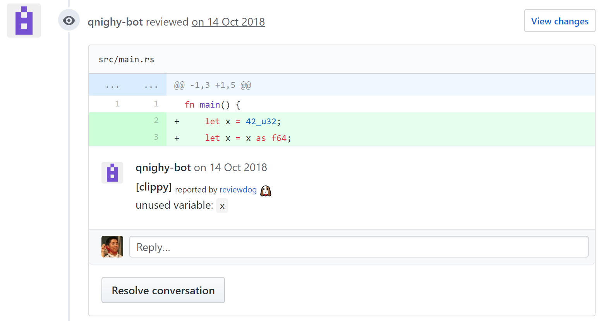

## A filter for integrating [Clippy](https://github.com/rust-lang/rust-clippy) with [Reviewdog](https://github.com/haya14busa/reviewdog)



### What's this?

[Reviewdog](https://github.com/haya14busa/reviewdog) is an automated review tool. It extracts relevant parts for the patch from an output of an external linter, and reports the result in several formats, including GitHub Checks and GitHub comments.

`clippy-reviewdog-filter` is a simple filter for feeding Reviewdog an output of Clippy, the official linter for Rust.

### How to try this locally

No more interesting than simply running Clippy if you run this locally, but if you want to try this out before putting this into a CI:

Install reviewdog: get [the binary release](https://github.com/haya14busa/reviewdog/releases) or

```
$ go get -u github.com/haya14busa/reviewdog/cmd/reviewdog
```

Install clippy-reviewdog-filter: get [the binary release](https://github.com/qnighy/clippy-reviewdog-filter/releases) or

```
$ cargo install --git https://github.com/qnighy/clippy-reviewdog-filter.git
```

```
cargo clippy --message-format json 2>&1 | clippy-reviewdog-filter | reviewdog -f=checkstyle -diff="git diff master"
```

### Configuration example

Configuration taken from [a sample repository](https://github.com/qnighy/reviewdog-test):

`travis.yml`:

```yaml
language: rust
env:
  global:
    # See the reviewdog manual for how to obtain the token.
    # Beware that, encrypted environment variables cannnot be seen in
    # builds for pull requests from fork repositories.
  - REVIEWDOG_GITHUB_API_TOKEN=0123456789abcdef0123456789abcdef0123456789abcdef
install:
- mkdir -p ~/bin
- export PATH="$HOME/bin/:$PATH"
- curl -fSL https://github.com/haya14busa/reviewdog/releases/download/0.9.11/reviewdog_linux_amd64 -o ~/bin/reviewdog
- curl -fSL https://github.com/qnighy/clippy-reviewdog-filter/releases/download/v0.1.1/clippy-reviewdog-filter-x86_64-unknown-linux-musl -o ~/bin/clippy-reviewdog-filter
- chmod +x ~/bin/reviewdog ~/bin/clippy-reviewdog-filter
- rustup component add clippy-preview
script:
- reviewdog -reporter=github-pr-review
```

`.reviewdog.yml`:

```yaml
runner:
  clippy:
    cmd: 'find . -type f -name \*.rs -exec touch {} \;; cargo clippy --message-format json 2>&1 | clippy-reviewdog-filter'
    format: checkstyle
```

### Note on security

If you want to use the `github-pr-review` reporter in `.travis.yml`, you're essentially going to publish your API Token to the submitters of pull requests, as they're free to run modified versions of `.travis.yml` on your Travis CI repo.

For better security, you may want to use the `github-pr-check` reporter instead or run `reviewdog -reporter=github-pr-review` in a more isolated environment, like in a dedicated GitHub Webhook server.

Of course, there's no problem with using `github-pr-review` in a private repository with no forks. In that case, you can just encrypt the github token using the `travis encrypt` command.
